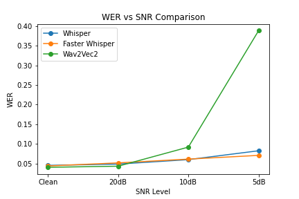
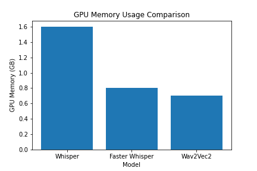

#  Speech-to-Text Model Comparison Under Noisy Conditions

##  Project Overview

This project presents a comparative evaluation of three state-of-the-art Automatic Speech Recognition (ASR) models:

- Whisper
- Faster Whisper
- Wav2Vec2

The objective was to evaluate their robustness under noisy audio conditions and compare them across:

- Word Error Rate (WER)
- Inference time
- GPU memory usage
- Deployment complexity

The final recommendation is based on a balance of accuracy, efficiency, and production readiness.

##  Models Evaluated

| Model | Architecture | Key Strength |
|--------|-------------|--------------|
| Whisper | Transformer Encoder-Decoder | Strong noise robustness |
| Faster Whisper | Optimized Whisper (CTranslate2) | Lower latency & memory |
| Wav2Vec2 | Self-supervised + CTC | Excellent clean audio accuracy |

##  Experimental Setup

- Environment: Google Colab GPU
- Noise Injection: White Gaussian Noise
- SNR Levels Tested:
  - Clean
  - 20dB
  - 10dB
  - 5dB
- Evaluation Metric:
  - Word Error Rate (WER)

Additional Metrics:
- Total script runtime
- GPU memory usage
- Ease of deployment

##  Results

###  Word Error Rate (WER)

| Model | Clean | 20dB | 10dB | 5dB |
|--------|--------|--------|--------|--------|
| Whisper | 0.0458 | 0.0491 | 0.0604 | 0.0829 |
| Faster Whisper | 0.0443 | 0.0521 | 0.0617 | 0.0712 |
| Wav2Vec2 | 0.0409 | 0.0437 | 0.0922 | 0.3879 |

 Observation:
- Wav2Vec2 performs best on clean audio.
- Severe degradation at 5dB noise.
- Faster Whisper demonstrates strongest robustness under extreme noise.

###  GPU Memory Usage

| Model | GPU Memory |
|--------|------------|
| Whisper | 1.6 GB |
| Faster Whisper | 0.8 GB |
| Wav2Vec2 | 0.7 GB |

 Faster Whisper reduces memory usage by 50% compared to Whisper.

###  Inference Time

| Model | Total Runtime |
|--------|---------------|
| Whisper | 15 minutes |
| Faster Whisper | 12.5 minutes |
| Wav2Vec2 | 14 minutes |

 Faster Whisper achieved the lowest runtime.

##  Final Recommendation

###  Selected Model: Faster Whisper

Faster Whisper provides the best balance of:

- Strong noise robustness
- Lower GPU memory usage
- Faster inference time
- Production-ready optimization support

It is the most suitable candidate for real-world deployment in noisy environments.

##  Suggested Production Architecture
Audio Input
↓
Preprocessing (Resampling, Normalization)
↓
Voice Activity Detection (VAD)
↓
Faster Whisper (Quantized)
↓
Post-processing
↓
API Response

Recommended Enhancements:
- INT8 Quantization
- Mixed Precision Inference
- Noise-aware Fine-tuning
- Batch Processing

##  Repository Structure

speech-model-comparison/
│
├── report/
│   └── technical_report.md
│
├── results/
│   ├── wer_vs_snr.png
│   ├── gpu_memory.png
│   └── inference_time.png
│
├── scripts/
│   ├── asr_project_faster_whisper.py
│   ├── asr_project_faster_whisper_noise_insertion.py
│   ├── asr_project_wav2vec2.py
│   ├── asr_project_wav2vec2_noise_inserted.py
│   ├── asr_project_whisper.py
│   └── asr_project_whisper_noise_inserted.py
│
├── requirements.txt
└── README.md

##  Installation

Clone the repository: 

git clone https://github.com/abhishekharode/speech-model-comparison.git

cd speech-model-comparison

Install dependencies:

pip install -r requirements.txt

##  Running Experiments

Example: python scripts/asr_project_faster_whisper.py

## Full Technical Report

Detailed methodology and analysis available in: report/technical_report.md

##  Author

Abhishek Harode

##  Key Takeaway

While Wav2Vec2 excels in clean conditions, Faster Whisper offers the most robust and efficient solution for real-world noisy audio environments.

This makes it the preferred production-ready ASR model among the evaluated options.

